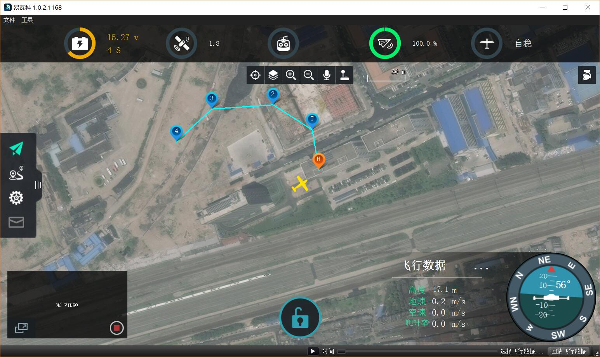
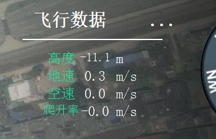

# 飞行页面

飞行视图是飞行您的无人机时将使用的主视图。 您可以在地图视图和视频视图（如果有）之间切换。

## 飞行工具栏
在屏幕的正中间上方，你会看到飞行工具。 工具从左到右的顺序是：
* 定位地图中心
* 地图类型
* 地图缩放大/小
* 地面站警告声音提示
* 虚拟遥控

### 定位地图中心
定位地图中心工具允许您地图以各种点（如起始位置，无人机等）居中。

### 地图类型
此工具允许您更改街道，卫星和混合（街道+卫星）之间的当前地图类型。 默认地图提供程序是Bing，因为它似乎提供更好的混合地图。 您可以从“设置”的“系统设置”页面更改地图提供商。

## 视频显示
在显示屏的左下角，您将看到视频输出。 地面站系统支持RTP和RTSP视频流通过您的无人机UDP连接。 它还支持直接连接的UVC设备。 

通过点击视频，您可以使其成为飞行视图的主显示。
## 姿态仪
右下角是一个仪表板，显示您无人机的最新信息。 显示姿态角度，航向角

### 飞行数据显示

飞行数据显示的值可以通过单击...图标进行配置。

## 引导工具
在视图的底部是引导栏。 导航栏允许直接从QGroundControl应用程序与您的车辆进行交互。 可用的选项因车辆和当前车辆状态而异。

一些可能的选项是：

*手臂，撤防，紧急停止
* 脱掉
*更改altitiude
* 移动到目标位置
* 返航
* 暂停
