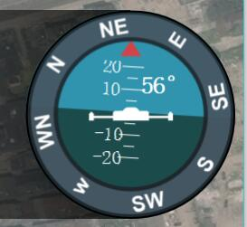

# 飞行页面

飞行视图是飞行您的无人机时将使用的主视图。 您可以在地图视图和视频视图（如果有）之间切换。

## 飞行工具栏
在屏幕的正中间上方，你会看到飞行工具。 工具从左到右的顺序是：
* 定位地图中心
* 地图类型
* 地图缩放大/小
* 地面站警告声音提示
* 虚拟遥控

### 定位地图中心
定位地图中心工具允许您地图以各种点（如起始位置，无人机等）居中。

### 地图类型
此工具允许您更改街道，卫星和混合（街道+卫星）之间的当前地图类型。 默认地图提供程序是Bing，因为它似乎提供更好的混合地图。 您可以从“设置”的“系统设置”页面更改地图提供商。

## 视频显示
在显示屏的左下角，您将看到视频输出。 地面站系统支持RTP和RTSP视频流通过您的无人机UDP连接。 它还支持直接连接的UVC设备。 

通过点击视频，您可以使其成为飞行视图的主显示。
## 姿态仪
右下角是一个仪表板，显示您无人机的最新信息。 显示姿态角度，航向角

### 数据显示

The values shown within the telemetry page can be configured by clicking on the small gear icon.

## Guided Bar
At the bottom of the view is the Guided Bar. The guided bar allows to to interact with your vehicle directly from the QGroundControl application. Options available vary by Vehicle and current Vehicle state. 

Some of the possible options are:

* Arm, Disarm, Emergency Stop
* Takeoff
* Change altitiude
* Go to location
* RTL
* Pause
