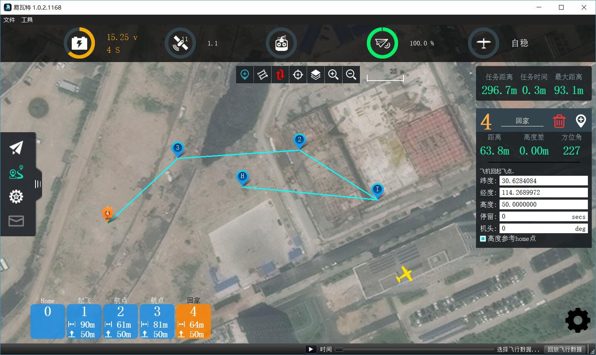

# 航线规划

航线规划计划视图用于为您的无人机规划自主任务。 一旦任务被计划并发送到无人机，你切换到 [飞行页面](FlyView.md) 来飞行任务

如果你设置里地理围栏，你也可在航线规划试图中看见它.

上图显示了一个简单的任务，从起飞开始，飞过两个航点，然后返航。

创建任务的步骤是：

1.切换到航线规划视图
2.向任务添加命令并根据需要进行编辑
3.将任务发送到无人机
4.切换为飞行视图并飞行您的任务

## 飞行页面工具
在屏幕中上方，您将看到计划工具。 工具从上到下的顺序是：

* 添加航点
* 自动扫描航线（Survey.md）
* 同步
* 中心地图
* 地图类型
* 放大/缩小

### 添加航点
单击以激活添加航点命令工具。 当激活时，点击地图将在点击的位置添加新的任务命令。 该工具将保持有效，直到您再次单击它。

### 同步
同步工具允许您将任务来回移动到您的无人机或文件。 *飞行任务之前，您必须确保将您的任务发送到您的无人机。*该工具变为红色，以指示您对您的任务的更改，您尚未发送任务到您的无人机。

同步工具提供以下功能：

* 发送到无人机
* 从无人机载入
* 保存到文件
* 从文件加载
* 移除所有航点

### Survey

[Survey](Survey.md) allows you to fly a grid pattern over a polygonal area.

## Mission Command List
On the right edge of the display is the list of mission commands for this mission. You can click on one of these to edit the values for the item. Above are a set of options to switch between editing the Mission, GeoFence and Rally Points.

### Mission Command Editors

Click on a mission command to show its editor which allows you to specify the values for the command. You can also change the type of the command by clicking on the command name, "Waypoint" in this example. This allows you to pick from the set up available commands to build your mission. To the right of the command name is a menu you can open by clicking. This menu provides you access to additional options such as Insert and Delete.

### Planned Home Position
A mission always has a "Planned Home Position" associated with it. This is used to simulate the home position of the vehicle such that waypoint lines can be drawn correctly to the first actual waypoint. Keep in mind that the actual home position for a mission is set by the vehicle and may differ from the "planned" home position if you don't begin your mission with the vehicle in the same location as "planned".

## Mission Display
In the center of the map you will see a visualization of your current mission. You can click on the inicators to select then and then you can also drag them around to move them.

## Mission Height Display
At the bottom of the map you will see a representation of the height differences between your mission commands. To the left of that is information for the currently selected command relative to the previous command. For example: Distance from previous waypoint.