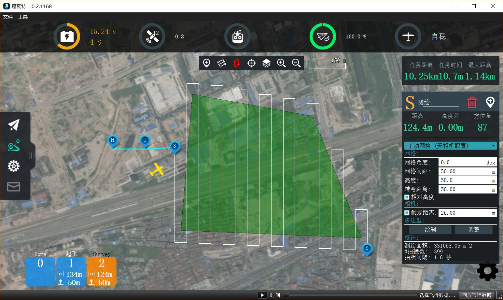
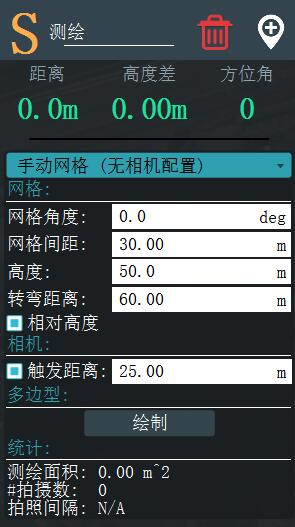
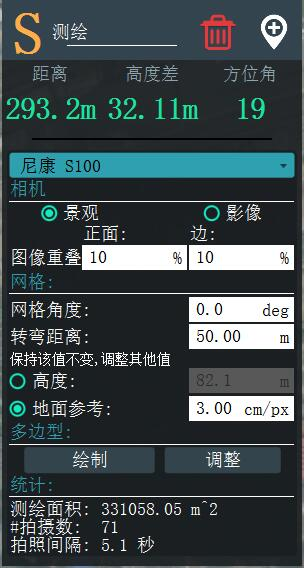
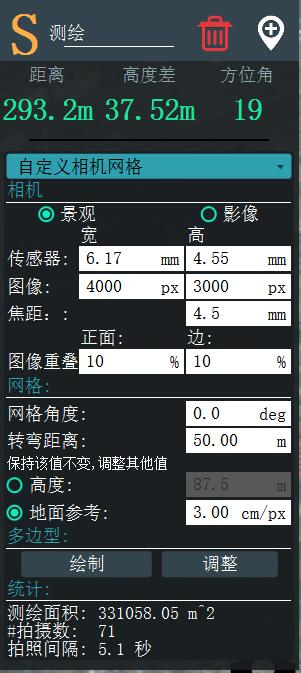

# 计划 - 网格航线

调查允许您在多边形区域上创建网格线条图案。 您可以指定多边形以及适用于创建带有地理标记的图像的网格和摄像机设置的规格。

要为您的调查绘制多边形，请单击“绘制”按钮，然后在地图中单击以设置多边形顶点。

网格航线有多个选项。 您可以从编辑器顶部的下拉菜单中选择主选项。

## 手动网格

手动网格选项允许您指定用手在多边形上生成网格图案的所有值。

    * 网格角     - 网格的平行飞行轨迹的角度。 例如0度将产生向南/向南行进的平行线。
    * 网格间距   - 每个平行飞行轨迹之间的距离。
    * 高度       - 飞行整个网格图案的高度。
    * 周转距离   - 在执行下一个飞行轨迹的周转之前，飞越多边形边缘的额外距离。
    * 触发距离   - 用于根据飞行距离触发摄像机拍摄的图像。

## 相机预设

从选项下拉菜单中选择已知的摄像机，您可以根据摄像机的规格生成网格图案。

* 横向/纵向 - 指定相机放置在车辆上的方向。
* 图像叠加 - 允许您指定每个图像之间想要的重叠量。
* 高度 - 选择此值允许您指定测量的高度。 将计算并显示指定高度的地面分辨率。
* 地面分辨率 - 选择此值可以指定每个图像所需的地面分辨率。 计算并显示达到此分辨率所需的高度。

## 自定义相机

自定义摄像机选项与已知的摄像机选项类似。 不同之处在于您必须自己指定相机规格的详细信息。

* 传感器宽度/高度     - 相机的图像传感器的尺寸。
* 图像宽度/高度     - 相机捕获的图像的分辨率。
* 焦距     - 相机镜头的焦距。