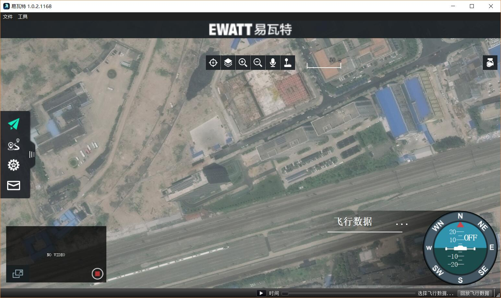
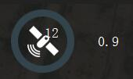
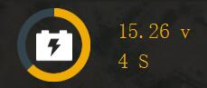

# 地面站系统
下图是地面站系统未连接飞控状态
 

 
 **[飞行页面](../FlyView/FlyView.md)**
 飞行页面，监控无人机数据，以及图像传输

 **[航点规划](../PlanView/PlanView.md)**
 航点规划页面，自动规划航点

 **[无人机设置](../SetupView/SetupView.md)**
 地面站系统设置和配置你的无人机

 **无人机消息**
  无人机如果有警告消息，会自动弹出显示，提示您一些未完成设置和错误
# 连接无人机
在大多数情况下，如果您通过USB，通过数传电台或WiFi直接连接到无人机，您不需要采取任何额外的步骤。 地面站系统会自动连接。

默认情况下，地面站系统将显示如下所示的飞行视图。 如果您的无人机机需要额外的设置，您将自动显示设置视图。
 

 
您会注意到，工具栏在连接时包含其他信息。 它显示您的无人机的状态。 通过点击这些项目您可以看到更多的详细信息。

 **GPS状态**
 显示GPS卫星颗数和水平精度

 **遥控状态** 
 RS signal strength information.

 **数传状态**
 Telemetry signals strength information.

 **电池状态**
 Remaining battery percent.

 **Flight Mode**
 Current flight mode. Click to change flight mode.
