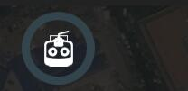

# 地面站系统
下图是地面站系统未连接飞控状态
 

 
 **[飞行页面](../FlyView/FlyView.md)**
 飞行页面，监控无人机数据，以及图像传输

 **[航点规划](../PlanView/PlanView.md)**
 航点规划页面，自动规划航点

 **[设置](../SetupView/SetupView.md)**
 地面站系统设置和配置你的无人机

# 连接无人机
在大多数情况下，如果您通过USB，通过数传电台或WiFi直接连接到无人机，您不需要采取任何额外的步骤。 GroundStation会自动连接。

默认情况下，GroundStation将显示如下所示的飞行视图。 如果您的无人机机需要额外的设置，您将自动显示设置视图。
 

 

You will notice that the toolbar contains additional information when it is connected. It shows you high level status for your vehicle. By clicking on any of these items you can see more detailed information. 

 **Vehicle Messages**
 Click to show a dropdown of messages from the vehicle. This will change to a Yield sign if there are critical messages.

 **GPS Status**
 Shows you satellite count and curent hdop.

 **RC RSSI** 
 RS signal strength information.

 **Telemetry RSSI**
 Telemetry signals strength information.

 **Battery**
 Remaining battery percent.

 **Flight Mode**
 Current flight mode. Click to change flight mode.
