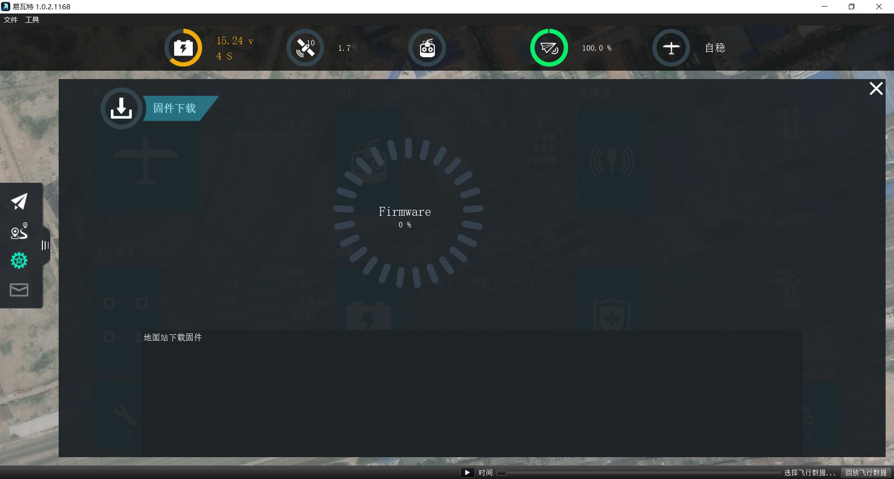

# 固件更新

使用GroundStation地面站系统，您可以安装固件的最新版本。 
### 更新固件之前(注意)

在将固件安装到无人机上之前，必须断开与车辆的所有USB连接，无论是直接连接还是通过遥测收音机。 此外，车辆不得由电池供电。 

### 通过USB连接你的飞控

现在使用USB将您的设备直接连接到计算机。 不要通过USB集线器连接。 只能直接连接到机器上的供电USB端口。
一旦设备连接 固件自动下载更新

### 固件更新成功

一旦指定的固件完成加载，无人机将重新启动并重新连接。
* 注意：支持加载固件目前不适用于平板电脑或手机版本*
