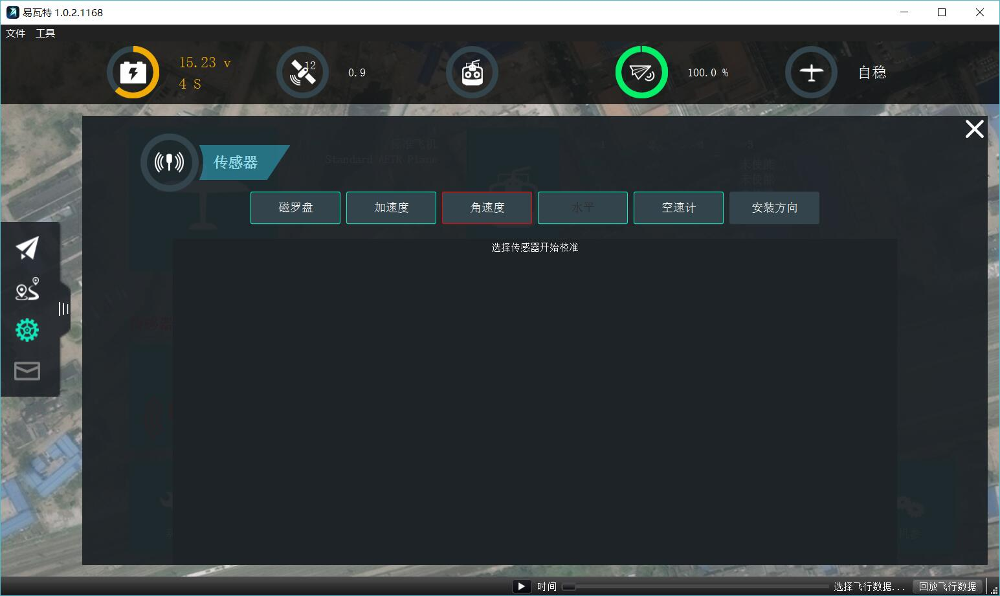
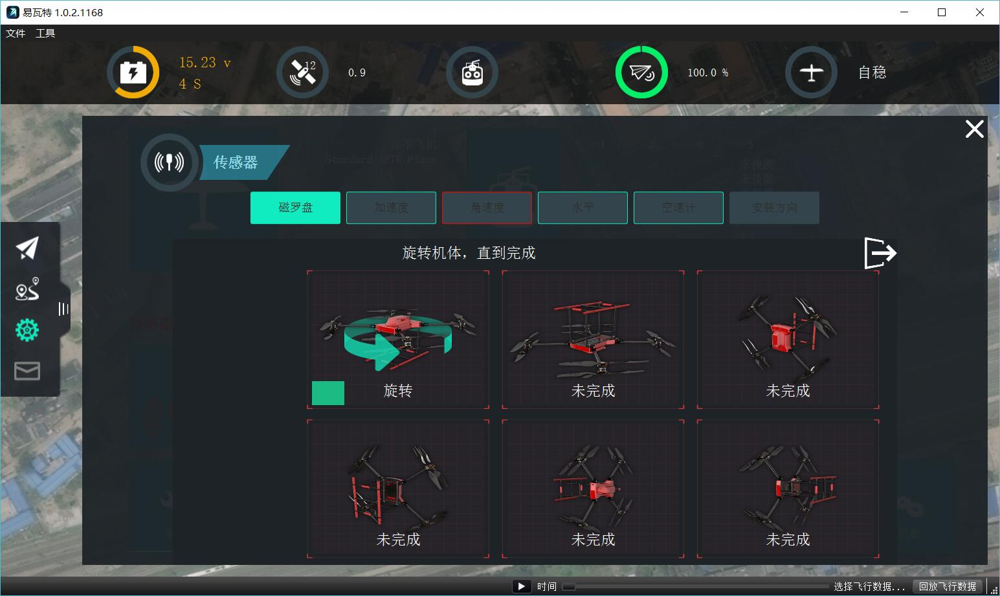
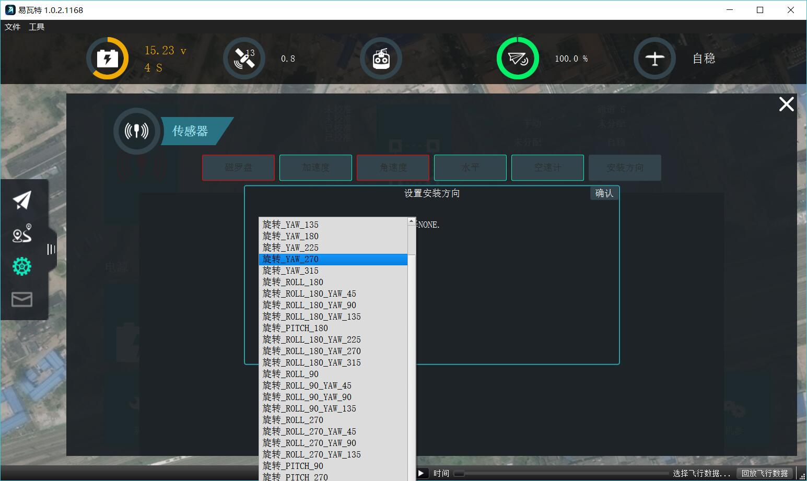

# 传感器
传感器设置允许您配置和校准无人机上的传感器。

* 注：显示的图像来自运行固定翼固件的无人机。 多旋翼固件选项将略有不同。*

要启动单个校准步骤，请单击传感器的按钮。 标有红色的传感器需要在飞行前校准。 标有绿色的传感器表示良好的校准。

## 加速度计
要校准无人机上的加速度计，您将被要求将您的无人机放置在一个方向，并保持在那里，直到要求移动到下一步。

您可以任意调换顺序进行引导。

## Compass

### ArduPilot (newer firmwares)
For newer ArduPilot firmwares compass calibration will be done using the Onboard calibration support which provides for more accurate calibration. You need to rotate the vehicle randomly around all axes until the progress bar fills all the way to the right and the calibration completes. When the calibration completes you will get the following results:

This shows you the quality of the calibration for each compass. Using these values you can determine whether you may want to turn off usage of poorly performing compasses.

### ArduPilot (older firmwares) and PX4

For PX4 and older ArduPilot you will be guided through positioning the vehicle in a number of set orientations and rotating the vehicle through the request axis. To calibrate place the Vehicle in one of the incomplete orientations and hold it still, when asked to Rotate rotate the vehicle around the specific axis.

## Level Horizon
If after completing Accelerometer calibration you see that the horizon as shown in the HUD is not level you can calibrate the level horizon for your vehicle. You will be asked to place the vehicle in a level orientation while it captures the information.

## CompassMot (ArduPilot only)
CompassMot calibration is only recommended for vehicles that have only an internal compass and on vehicles where there is significant interference on the compass from the motors, power wires, etc. CompassMot only works well if you have a battery current monitor because the magnetic interference is linear with current drawn.

To perform CompassMot calibration click the button and follow the onscreen prompts.

## Sensor Settings
Configure the orienation and usage of your sensors.

