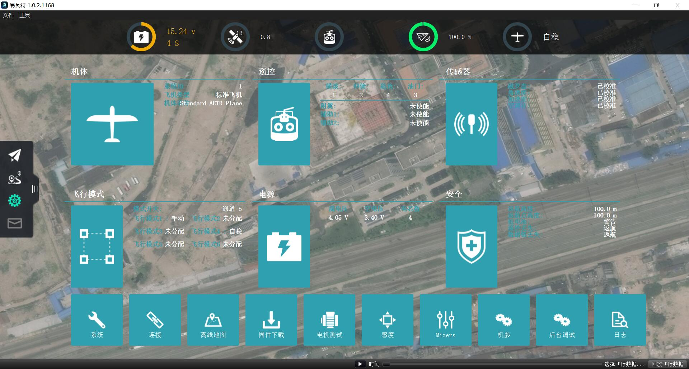

# 设置

设置视图用于在首次飞行之前配置新无人机和/或调整配置的无人机参数。

### 设置选项

屏幕中间是可用的设置选项集。 如果仍有需要调整/指定的设置，则设置按钮将标记为红色图标。 你不应该飞行，如果这些都是红色的。 在上面的图像中，模式设置尚未完成。

注意：显示的选项集和每个选项的内容可能会根据无人机固件而有所不同。

**系统设置**
 An overview of all the important setup options for your vehicle. Similar to the individual setup buttons, the summary blocks show a red indicator when those settings are not fully configured.

**[Firmware](Firmware.md)**
 Flash new firmware onto your vehicle.

**[Airframe](Airframe.md)**
 Specify the airframe type for the vehicle.

**[Radio](Radio.md)**
 Calibrate your Radio Control Transmitter.

**[Sensors](Sensors.md)**
 Calibrate the sensors on the vehicle.

**[Flight Modes](FlightModes.md)**
 Used to assign flight modes to your RC Transmitter switches.

**[Power](Power.md)**
 Battery settings and additional power options such as ESC calibration.

**[Safety](Safety.md)**
 Specify settings for options related to Safety such as Return to Home or Failsafes.

**[Tuning](Tuning.md)**
 Tune flight characteristics of the vehicle.

**[Camera](Camera.md)**
 Configure settings for camera and gimbal.

**[Parameters](Parameters.md)**
 Allows you to modify all parameters associated with your vehicle.
 
 
